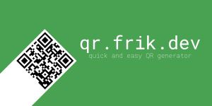

# QR Platform

A simple, fast, and intuitive web application for generating QR codes with real-time preview and customization options.



## Features

✨ **Simple & Intuitive UI** - Generate QR codes without complicated workflows

📱 **Multiple QR Types**
- Text/URL QR codes
- WiFi network sharing
- WhatsApp contact sharing (planned)
- Custom QR types (extensible architecture)

⚡ **Real-Time Preview** - See your QR code update as you type

🎨 **Customization Options**
- Error correction level (L, M, Q, H)
- QR code size adjustment
- Custom colors (dark/light themes)

💾 **Quick Download** - One-click download with timestamped filenames

📋 **History Tracking** - Recently generated QR codes stored in browser (localStorage)

🌍 **Internationalization** - English and Spanish support

🎯 **Dark Mode** - Modern dark theme by default

## Tech Stack

- **Framework**: [Nuxt 4](https://nuxt.com/) (Vue 3 with SSR)
- **Styling**: [Tailwind CSS v4](https://tailwindcss.com/) + [shadcn-nuxt](https://shadcn-nuxt.com/)
- **QR Generation**: [qrcode](https://github.com/davidshimjs/qrcodejs) library
- **Icons**: [lucide-vue-next](https://lucide.dev/)
- **Notifications**: [vue-sonner](https://vue-sonner.com/)
- **i18n**: [@nuxtjs/i18n](https://i18n.nuxtjs.org/)
- **Analytics**: Vercel Analytics & Speed Insights
- **Code Quality**: Prettier with import sorting and Tailwind class organization

## Quick Start

### Prerequisites

- Node.js 18+ 
- pnpm (recommended) or npm

### Installation

```bash
# Install dependencies
pnpm install

# Start development server
pnpm dev
```

Visit `http://localhost:3000` in your browser.

## Available Scripts

```bash
# Development
pnpm dev          # Start dev server on http://localhost:3000

# Production
pnpm build        # Build for production
pnpm preview      # Preview production build locally

# Code Quality
pnpm format       # Format code with Prettier

# Components
pnpm shad add [component-name]  # Add new shadcn component
```

## Project Structure

```
app/
├── pages/
│   └── index.vue              # Main QR generator page
├── components/
│   ├── QRGenerator.vue        # Main orchestrator component
│   ├── QRInput.vue            # Text/URL input
│   ├── QRWifiInput.vue        # WiFi credential input
│   ├── QRPreview.vue          # QR code canvas display
│   ├── QROptions.vue          # Customization options
│   ├── QRHistory.vue          # History panel
│   ├── QRTypeSelector.vue     # Type selector (planned)
│   ├── LanguageSwitcher.vue   # i18n locale switcher
│   ├── GitHubStars.vue        # Repository link
│   └── ui/                    # shadcn-nuxt components
├── composables/
│   ├── useQRCode.ts           # QR generation logic
│   └── useQRHistory.ts        # History management
├── assets/
│   └── css/tailwind.css       # Global styles
└── views/
    └── HomeView.vue           # Home page view

types/                         # TypeScript definitions
i18n/
├── locales/
│   ├── en.json               # English translations
│   └── es.json               # Spanish translations
```

## How It Works

The QR generation flow is centered around the main **QRGenerator.vue** component:

1. **Input**: User enters text, URL, or WiFi credentials
2. **Preview**: Real-time QR code rendering using the `qrcode` library
3. **Customize**: Optional adjustments (error correction, colors, size)
4. **Download**: One-click download with automatic filename
5. **History**: Recently generated QRs saved to browser storage

### QR Generation

The app uses the `qrcode` npm package to render QR codes:

```javascript
import QRCode from 'qrcode'

// Generate QR code to canvas
await QRCode.toCanvas(canvas, text, options)

// Export as image
canvas.toBlob(blob => {
  // Download blob
})
```

## Configuration

Key configuration files:

- **nuxt.config.ts** - Framework setup, modules, Tailwind plugin
- **components.json** - shadcn component registry and aliases
- **.prettierrc** - Code formatting rules (import sorting, Tailwind classes)
- **tsconfig.json** - TypeScript configuration

## Development Guidelines

### Adding a New QR Type

1. Create input component: `app/components/QRNewTypeInput.vue`
2. Update `QRGenerator.vue` to handle the new mode
3. Add translations to `i18n/locales/{en,es}.json`
4. Export interface for type safety

### Adding shadcn Components

```bash
pnpm shad add [component-name]
```

Components are auto-imported—no manual setup needed.

### Code Formatting

Run before committing:

```bash
pnpm format
```

Prettier will:
- Organize imports (3rd party → @/ aliases → relative)
- Sort Tailwind classes
- Enforce consistent spacing

## Internationalization

Translations are stored as JSON in `i18n/locales/`:

```json
{
  "title": "QR Code Generator",
  "mode": {
    "text": "Text",
    "wifi": "WiFi"
  }
}
```

Access in components:

```vue
<script setup>
const { t } = useI18n()
</script>

<template>
  <h1>{{ t('title') }}</h1>
</template>
```

## Deployment

The application is optimized for deployment on Vercel:

```bash
pnpm build    # Create production build
pnpm preview  # Test production locally
```

**Features:**
- ✅ Vercel Analytics enabled for page views and user behavior tracking
- ✅ Vercel Speed Insights enabled for Web Vitals monitoring
- ✅ Universal rendering (SSR) for better SEO and performance

## Browser Support

- Modern browsers with ES2020+ support
- All Chromium-based browsers (Chrome, Edge, etc.)
- Firefox and Safari (latest versions)

## Planned Features

- [ ] QRTypeSelector component for multi-format support
- [ ] WhatsApp contact sharing (QRWhatsAppInput)
- [ ] vCard format support
- [ ] Email format support
- [ ] Custom logo/image embedding in QR codes
- [ ] QR code batch generation
- [ ] Theme customization panel

## Performance

- ⚡ Real-time QR generation (instant preview)
- 🎯 Minimal dependencies
- 📦 Optimized bundle size with Tailwind CSS v4
- 🔄 Efficient SSR rendering with Nuxt 4

## License

This project is open source. Check the LICENSE file for details.

## Contributing

Contributions are welcome! Please:

1. Fork the repository
2. Create a feature branch (`git checkout -b feature/amazing-feature`)
3. Commit your changes (`git commit -m 'Add amazing feature'`)
4. Push to the branch (`git push origin feature/amazing-feature`)
5. Open a Pull Request

## Support

For issues, questions, or suggestions:
- Open an [Issue](https://github.com/osirisfrik/qr-platform/issues)
- Check existing discussions
- Review the [CLAUDE.md](./CLAUDE.md) for development guidelines

## Changelog

See [CHANGELOG.md](./CHANGELOG.md) for release notes and version history.

---

**Made with ❤️ for simple QR code generation**
